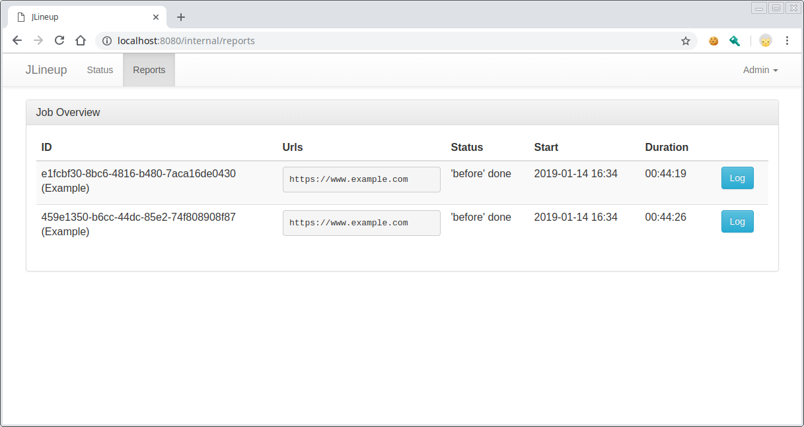
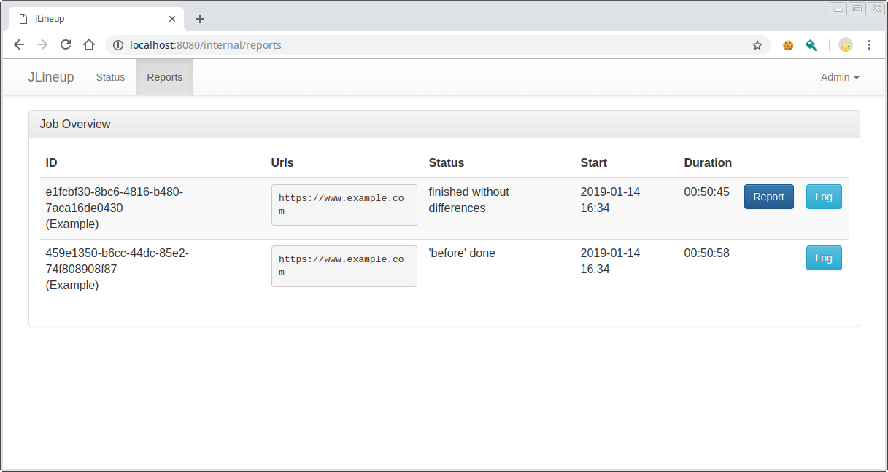

# Web server instructions

JLineup can be run as a small web service which offers a simple REST
interface to take JLineup jobs.

## Installation

You can simply download the web version by getting the jlineup-web.jar
from Maven Central in a terminal window:

`wget https://repo1.maven.org/maven2/de/otto/jlineup-web/3.0.0-rc7/jlineup-web-3.0.0-rc7.jar -O jlineup-web.jar`

Now you have a `jlineup-web.jar` in your current directory.

For best results, you need a "real" web browser installed on your system.
JLineup supports Google Chrome (Chromium also works) or Firefox at the
moment. As JLineup is written in Java, you need a Java Runtime
Environment in version 8 or higher. OpenJDK is fine!

JLineup can use PhantomJS internally, if no other browser is available.
This is not recommended, as PhantomJS is not maintained any more. More
and more modern web features don't work in PhantomJS, so it's only an
emergency fallback for very simple websites.

If those prerequisites are fulfilled, you can start the JLineup server:

`java -jar jlineup-web.jar`

If you see an error similar to this:

```
 [main] ERROR o.a.catalina.core.StandardService - Failed to start connector [Connector[HTTP/1.1-8080]]
...
Caused by: java.net.BindException: Address already in use
```

something else is running on port 8080 on your machine. You could stop
the conflicting server or you could run JLineup on another port like this:

`java -Dserver.port=5000 -jar jlineup-web.jar`

Everything is up and running now for your first steps. The examples assume
that JLineup runs on port 8080. Change them if you run it on a different one.

Head to http://localhost:8080/internal/status with a browser to see
JLineup's status page. It should look similar to this:


## REST Interface

JLineup has a small set of methods, which live in one context:

### Context: `/runs`

* ***GET*** `/runs/{runId}`
    * Gets you the status of a given run
    * runId is a String. You create a *runId* through starting a 'before' step
    * Parameters: None
    * The content type is application/json

* ***POST*** `/runs`
    * Post your [JLineup config](CONFIGURATION.md) to this endpoint to start a 'before' run.
    * If your config is valid, JLineup sends an `202 Accepted` return code.
    * The created *runId* is returned in the location header.
    * The content type is application/json

* ***POST*** `/runs/{runId}`
    * Starts an 'after' run for the given *runId*.
    * The content type is application/json

*Hint*: You can always see a human readable representation of your jobs
on http://localhost:8080/internal/reports

### Example

Use a REST client of your choice ans post the example config to your server:

POST `http://localhost/runs/`

Body:

```
{
  "name": "Example",
  "urls": {
    "https://www.example.com" : {}
  },
  "browser": "chrome-headless"
}
```

Content-Type: application/json

You should get an 202 as answer. Just post the same config again to
create a second run.

If you go to http://localhost:8080/internal/reports now, you should see
your two runs like this:



Both runs finished the 'before' step, like their status says.

Now start the 'after' run for one of them by taking the existing ID and
post to it:

POST `http://localhost/runs/PUT_THE_ID_HERE`.

The reports page should show that one of the runs went through the 'after'
step and a report was generated:



You can click on the *Report* button to see the report:


Click on the green url to open the details:


